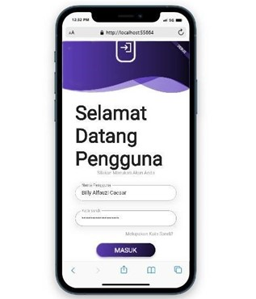

# Tugas Pemrograman Mobile 2
# Ujian Tengah Semester
## Profile
<body>
    <table border="1">
        <tr>
            <th> Nama</th>
            <th>NIM</th>
            <th>Kelas</th>
        </tr>
        <tr>
            <td>Billy Alfauzi Caesar</td>
            <td>312110152</td>
            <td>TI.21.A.1</td>
        </tr>
    </table>
</body>

## Output

## Done

# Panjang Umur Untuk Semua Hal-Hal Baik